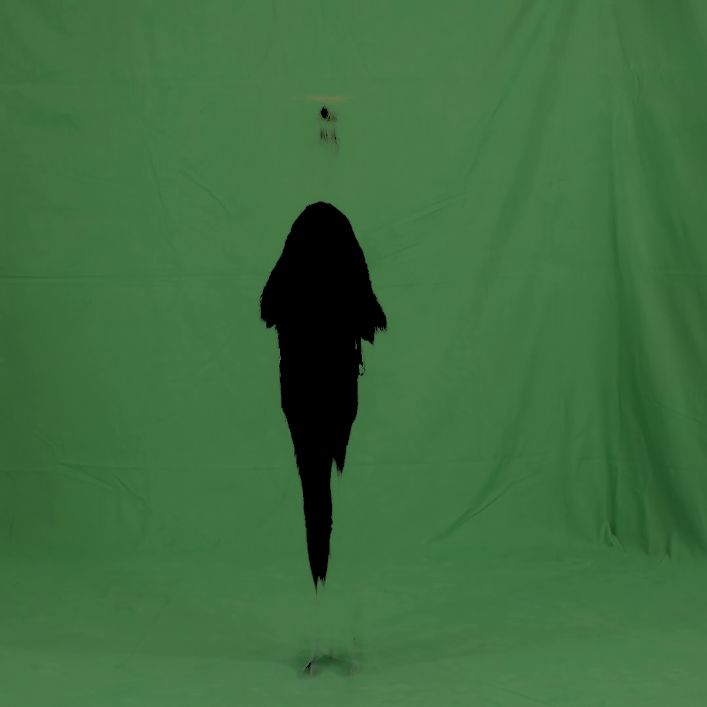
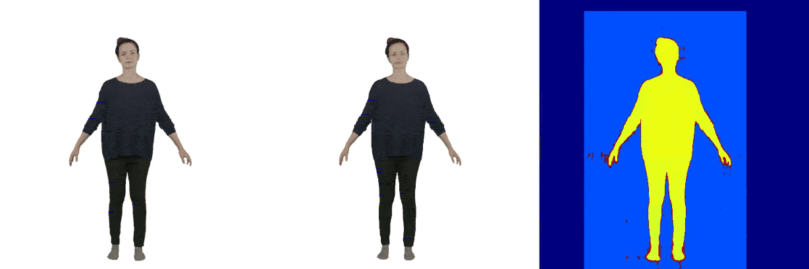
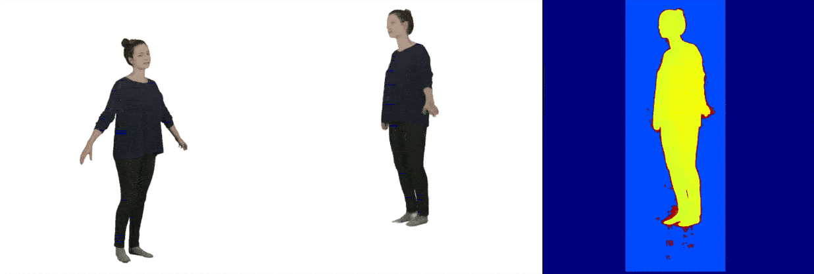
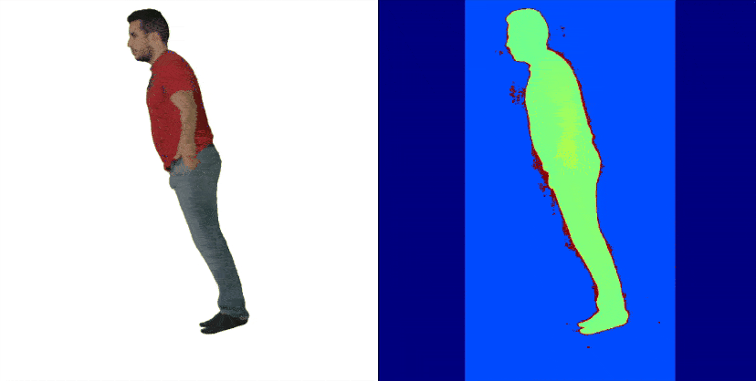

# MoCo-Flow: Neural Motion Consensus Flow for Dynamic Humans in Stationary Monocular Cameras (Eurographics 2022)

:star: Building the dynamic digital human by only using a mobile phone!

[Project Page](https://wyysf-98.github.io/MoCo_Flow/) | [Paper](https://arxiv.org/pdf/2106.04477.pdf)


This is an official implementation. Any questions or discussions are welcomed!

## Note
* Our main contribution is to propose an easy and general solution to constrain the dynamic motion flow.
* We treat all the data are in-the-wild in the main paper and only use a video without any annotated data.
* Following the [TAVA](https://arxiv.org/pdf/2206.08929.pdf), we show the design differences of different dynamic NeRFs.

| Methods                                                 | Template-free      | No Per-frame Latent Code | 3D Canonical       | Space Deformation |
|---------------------------------------------------------|--------------------|--------------------------|--------------------|-------------------|
| [ NARF ]( https://arxiv.org/abs/2104.03110 )            | :heavy_check_mark: |    :heavy_check_mark:    |         :x:        |      Inverse      |
| [ A-NeRF ]( https://arxiv.org/abs/2102.06199 )          | :heavy_check_mark: |            :x:           |         :x:        |      Inverse      |
| [ Animatable-NeRF ]( https://arxiv.org/abs/2105.02872 ) |         :x:        |            :x:           | :heavy_check_mark: |      Inverse      |
| [ HumanNeRF ]( https://arxiv.org/abs/2201.04127 )       |         :x:        |    :heavy_check_mark:    | :heavy_check_mark: |      Inverse      |
| [ NeuralBody ]( https://arxiv.org/abs/2012.15838 )      |         :x:        |            :x:           | :heavy_check_mark: |      Forward      |
| [ TAVA ]( https://arxiv.org/pdf/2206.08929.pdf )        | :heavy_check_mark: |    :heavy_check_mark:    | :heavy_check_mark: |      Forward      |
| Ours(MoCo-Flow)                                         | :heavy_check_mark: |            :x:           | :heavy_check_mark: |  Inverse+Forward  |

* Our work is placed to *strict monocular*, more details can be seen in [Monocular Dynamic View Synthesis A Reality Check](https://arxiv.org/pdf/2210.13445.pdf).


## Prerequisite

### `Setup environment`
 - Python 3.8
 - PyTorch 1.9.0
 - [KNN_CUDA](https://github.com/unlimblue/KNN_CUDA)
 - [VIBE](https://github.com/mkocabas/VIBE) for human pose estimation. Please follow their installation tutorial, and move it to scripts folder.
 - [SMPL](https://smplify.is.tue.mpg.de/). Download the SMPL models, and unpack to **utils/smpl/data**. 
 - [RobustVideoMatting](https://github.com/PeterL1n/RobustVideoMatting) for video matting.

The final file structure shuold be as following:

```
├── scripts
│   ├── VIBE
│   └── ...
└── utils
    └── smpl
        └── data
            ├── basicmodel_f_lbs_10_207_0_v1.1.0.pkl
            ├── basicmodel_m_lbs_10_207_0_v1.1.0.pkl
            └── basicmodel_neutral_lbs_10_207_0_v1.1.0.pkl
```

Install the required packages.

    pip install -r docker/requirements.txt

** We also provide a Dockerfile for easy installation.

    docker build -t moco_flow:latest ./


## Run on People-Snapshot / ZJU-Mocap / In-the-wild Monocular Data

** Please note that we do *not* use any annotated data, such as GT SMPL parameters from People-Snapshot/ZJU-Mocap dataset. We treat all the monocular videos are in-the-wild for practicality.** 


### `Preprocess the monocular video`

** To get the best result, we highly recommend a video clip that meets the similar requirements like [Human-NeRF](https://github.com/chungyiweng/humannerf):

First, get a video and place into a folder, such as **data/youtube/videos/xxx.mp4**. 

Second, run the data preprocessing script.

    VIDEO_PATH='../data/youtube/videos/xxx.mp4'            # input video path
    SAVE_PATH='../data/youtube/xxx'                        # output folder 
    START_FRAME=2295                                       # start frame of the video
    END_FRAME=2415                                         # end frame of the video
    INTERVAL=1                                             # sampling interval

    cd scripts
    python preprocess_data.py --input_video $VIDEO_PATH \
                            --output_folder $SAVE_PATH \
                            --start_frame $START_FRAME \
                            --end_frame $END_FRAME \
                            --interval $INTERVAL
    cd ..

Then you shoud get a folder in $SAVE_PATH as following:

```
└── data
    └── youtube
        └── xxx
            ├── images          # images without background
            ├── images_w_bkgd   # images with background
            ├── init_nerf       # rendered images to initialize canonical NeRF
            ├── background.png  # static background image, a trick to handle imperfect matting (deprecated)
            ├── train.json      # annotated file
            ├── val.json        # annotated file
            ├── xxx.mp4         # rendered video for pose estimation
            └── vibe_output.pkl # raw VIBE output file
```

video_vibe_result | background image
:-: | :-:
</img> | </img> 

Finally, modify the yaml file in configs, change the `dataloader.root_dir` in init_nerf.yaml, init_nof.yaml and c2f.yaml. We provide a template in ./configures, you can check the comments in the configuration file.


### `Train models`

We use 8 GPUs (NVIDIA Tesla V100) to train the models, which takes about 2~3 days as mentioned in our paper.
In fact, you can get reasonable results after running for two or three hours after starting joint training stage.

First, you should initialize the canonical NeRF model. This may takes ~6 hours using 4 GPUs.

    python -m torch.distributed.launch \
            --nproc_per_node=4 train.py \
            -c configs/xxx/init_nerf.yaml \
            --dist

Second, for fast convergence, you should initialize the forward/backward NoF model separately. This stage can be processed simultaneously and may takes ~6 hours using 4 GPUs.

    python -m torch.distributed.launch \
            --nproc_per_node=4 train.py \
            -c configs/xxx/init_nof.yaml \
            --dist

Finally, joint training using coarse to fine. This may takes ~1.5 days using 8 GPUs.
For distributed training, you should use:

    python -m torch.distributed.launch \
            --nproc_per_node=8 train.py \
            -c ./configs/xxx/c2f.yaml \
            --dist

Or, for sanity check, you can use:

    python train.py -c configs/xxx/c2f.yaml


### `Render output`

We provide some of the pre-trained model in [link](https://1drv.ms/u/s!AuxALCooalaxoQkGJT1iJyc0Lax2?e=BAZuUo).
(Due to privacy issue, we only provide the pre-trained models of people-snapshot.)
Please place the folder downloaded to ./ckpts.

Render the frame input (i.e., observed motion sequence).

    python test.py -c ./ckpts/female-3-casual/config.yaml \
                   --resume ./ckpts/female-3-casual/ckpts/final.pth \
                   --out_dir ./render_results/female-3-casual

</img> 


Run free-viewpoint rendering on a particular frame (e.g., frame 85).

    python test.py -c ./ckpts/female-3-casual/config.yaml \
                   --resume ./ckpts/female-3-casual/ckpts/final.pth \
                   --out_dir ./render_results/female-3-casual \
                   --render_spherical_poses \
                   --spherical_poses_frame 85

</img> 

Render the learned canonical appearance.

    python test.py -c ./ckpts/female-3-casual/config.yaml \
                   --resume ./ckpts/female-3-casual/ckpts/final.pth \
                   --out_dir ./render_results/female-3-casual \
                   --render_spherical_poses \
                   --spherical_poses_frame -1
    
</img> 

## Acknowledgement

The implementation partly took reference from [nerf_pl](https://github.com/kwea123/nerf_pl). We thank the authors for their generosity to release code.


## Citation

If you find our work useful for your research, please consider citing using the following BibTeX entry.

```BibTeX
@article{mocoflow,
         title = {MoCo-Flow: Neural Motion Consensus Flow for Dynamic Humans in Stationary Monocular Cameras},
         author = {Xuelin Chen and Weiyu Li and Daniel Cohen-Or and Niloy J. Mitra and Baoquan Chen},
         year = {2022},
         journal = {Computer Graphics Forum},
         volume = {41},
         number = {2},
         organization = {Wiley Online Library}
}
```